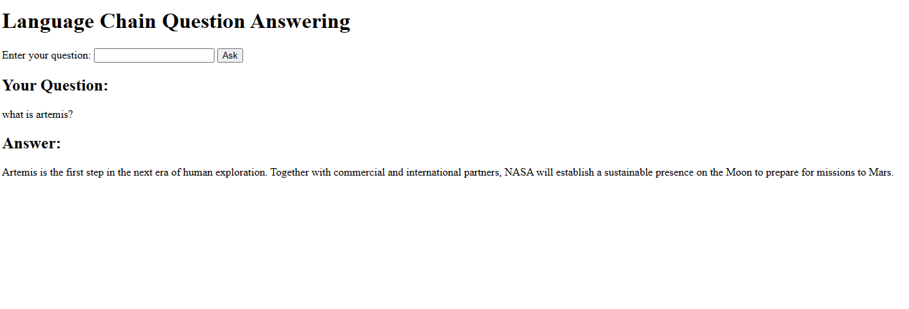

# Language Chain Question Answering with PALM2



This project demonstrates the integration of Language Chain, specifically Google's PALM2, to build a powerful question-answering system focused on NASA's Artemis program. By leveraging a combination of a large language model (LLM), web content, and Langchain, the system offers comprehensive and informative responses to user queries.

## Technologies Used

- **Flask:** A Python web framework for developing web applications.
- **Langchain:** A framework designed for developing and deploying advanced language models.
- **GooglePalm:** A substantial language model provided by Google AI.
- **WebBaseLoader:** A Langchain document loader responsible for fetching documents from the web.

## Project Structure

The project is organized as follows:

- **app.py:** The main file for the Flask application.
- **index.html:** The HTML template defining the user interface.
- **requirements.txt:** Lists the project's Python dependencies.
- **config.env:** A file containing sensitive environment variables, such as the Google API key.
- **Dockerfile:** The Docker configuration file for building the application as a container.

## Running the Project with Docker

To run the project using Docker, follow these steps:

1. Clone the project repository to your local machine:

   ```bash
   git clone https://github.com/TagDhanyal/web-content-enhanced-text-generation-with-palm2
2. Navigate to the project directory:
    ```bash
    cd web-content-enhanced-text-generation-with-palm2
3. Build the Docker image:

    ```bash
    docker build -t PaLm2WebContent
4. Run the Docker container:

    ```bash
    docker run -p 5000:5000 PaLm2WebContent
5. Open a web browser and navigate to http://localhost:5000.

## Using the Application

To use the application, simply enter a question in the provided text box and click the "Ask" button. The application will fetch relevant information from the web, generate an answer using the LLM, and display the result on the page.

## Example Usage
Here is an example of how to use the application:

1. Enter the question in the text box: "What is the Artemis program?"
2. Click the "Ask" button.
3. The application will retrieve pertinent information from NASA's Artemis blog, generate an answer using GooglePalm, and display the comprehensive overview of the Artemis program.
